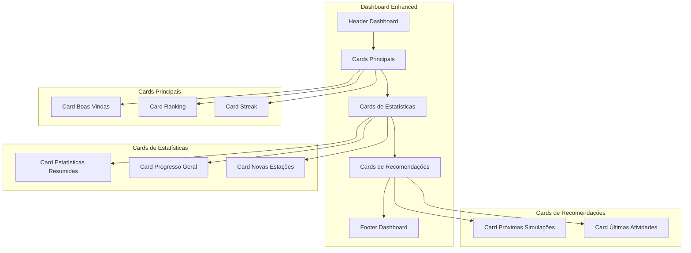
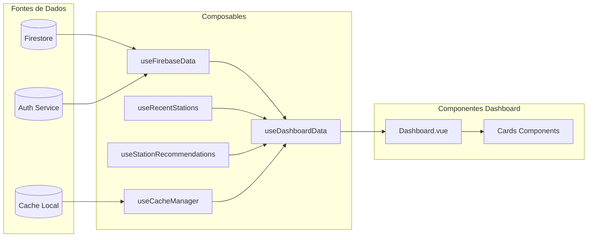
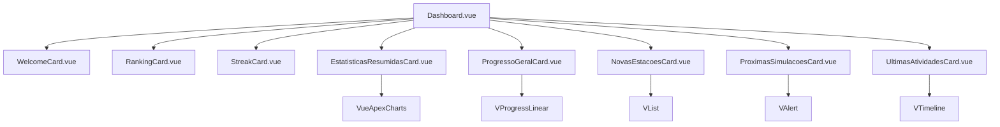
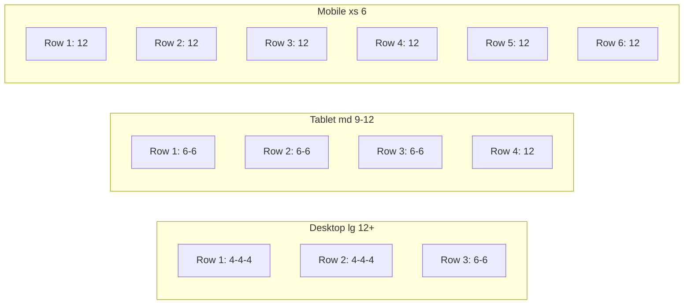
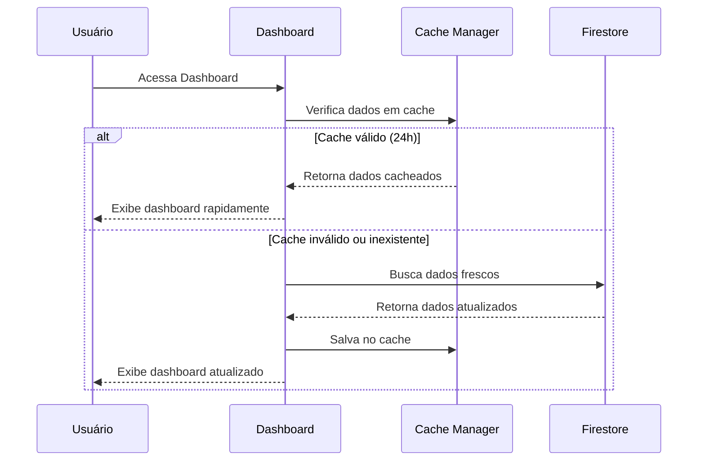
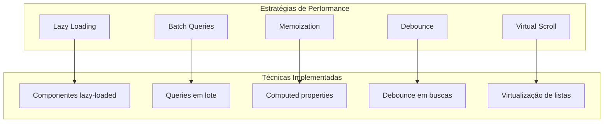
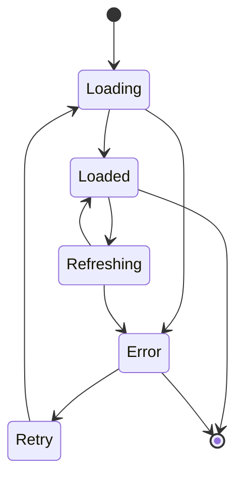
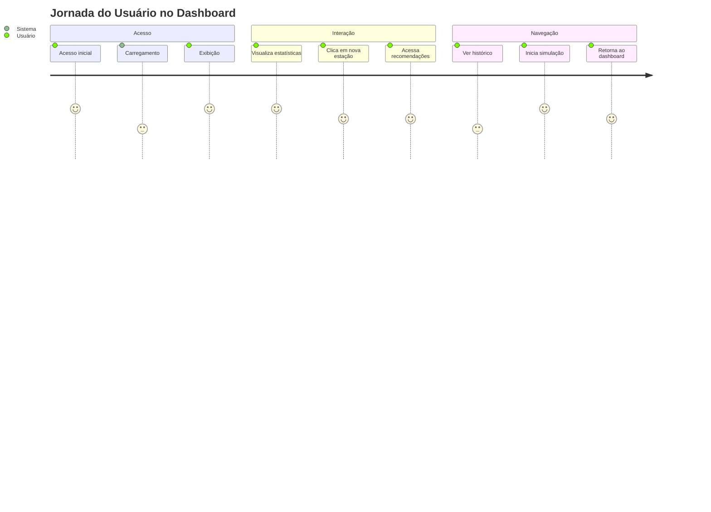
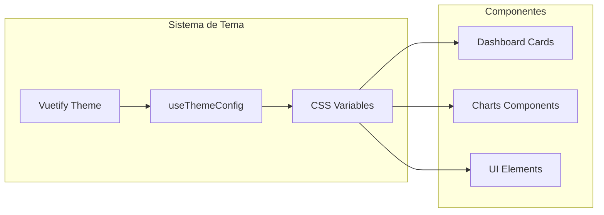

# DIAGRAMA DE ARQUITETURA DO DASHBOARD

## VISÃO GERAL DA ESTRUTURA



## FLUXO DE DADOS



## ESTRUTURA DE COMPONENTES



## LAYOUT RESPONSIVO



## ESTRATÉGIA DE CACHE



## PERFORMANCE E OTIMIZAÇÃO



## ESTADOS DA APLICAÇÃO



## MAPA DE INTERAÇÕES



## INTEGRAÇÃO COM TEMA



## ESTRUTURA DE DADOS

```mermaid
erDiagram
    USUARIO {
        string uid
        string nome
        number nivelHabilidade
        number ranking
        array estacoesConcluidas
        object statistics
    }
    
    ESTACAO {
        string id
        string idEstacao
        string tituloEstacao
        string especialidade
        timestamp criadoEmTimestamp
    }
    
    ESTATISTICAS {
        number mediaNotas
        number melhorNota
        number totalSimulacoes
        number streak
        object porEspecialidade
    }
    
    USUARIO ||--o{ ESTACAO : conclui
    USUARIO ||--|| ESTATISTICAS : possui