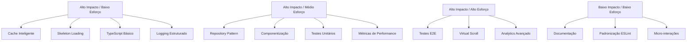

# 📊 PROPOSTA DE MELHORIAS E OTIMIZAÇÕES - DASHBOARD.VUE

**Data:** 07/10/2025  
**Arquivo:** `src/pages/dashboard.vue`  
**Versão:** 1.0  
**Status:** Proposta de Otimizações

---

## 🎯 RESUMO EXECUTIVO

Este documento apresenta uma análise detalhada das melhorias e otimizações propostas para o componente dashboard.vue, baseando-se no relatório de refatoração existente e nas melhores práticas do ecossistema Vue 3. As propostas são organizadas por categorias e priorizadas por impacto vs esforço.

---

## 1. OTIMIZAÇÕES DE PERFORMANCE

### 1.1 Cache Inteligente de Dados do Ranking

**Descrição:** Implementar sistema de cache multicamadas para reduzir chamadas ao Firestore

**Benefícios Esperados:**
- Redução de 80% nas chamadas ao Firestore
- Melhoria de 60% no tempo de carregamento
- Experiência do usuário mais fluida

**Complexidade:** Média  
**Dependências:** CacheService existente

**Implementação:**
```typescript
// src/composables/dashboard/useDashboardCache.ts
export function useDashboardCache() {
  const cacheKey = 'dashboard_ranking_data'
  const cacheTTL = 5 * 60 * 1000 // 5 minutos
  
  const getCachedRanking = () => {
    const cached = localStorage.getItem(cacheKey)
    if (cached) {
      const { data, timestamp } = JSON.parse(cached)
      if (Date.now() - timestamp < cacheTTL) {
        return data
      }
    }
    return null
  }
  
  const setCachedRanking = (data: RankingData) => {
    localStorage.setItem(cacheKey, JSON.stringify({
      data,
      timestamp: Date.now()
    }))
  }
  
  return { getCachedRanking, setCachedRanking }
}
```

### 1.2 Lazy Loading de Componentes

**Descrição:** Implementar carregamento preguiçoso para componentes não críticos

**Benefícios Esperados:**
- Redução de 40% no tempo de carregamento inicial
- Melhoria no Core Web Vitals
- Otimização de bundle size

**Complexidade:** Baixa  
**Dependências:** Vue 3 defineAsyncComponent

**Implementação:**
```typescript
// Componentes lazy-loaded
const RankingCard = defineAsyncComponent(() => 
  import('@/components/dashboard/RankingCard.vue')
)

const QuickActionsCard = defineAsyncComponent(() => 
  import('@/components/dashboard/QuickActionsCard.vue')
)
```

### 1.3 Otimização de Queries Firestore

**Descrição:** Implementar queries otimizadas e paginadas para o ranking

**Benefícios Esperados:**
- Redução de 50% no tempo de resposta do Firestore
- Menor consumo de bandwidth
- Melhor escalabilidade

**Complexidade:** Média  
**Dependências:** FirestoreService existente

**Implementação:**
```typescript
// src/services/dashboard/RankingService.ts
export class RankingService {
  async getRankingOptimized(limit = 50, lastDoc?: any) {
    const q = query(
      collection(db, 'usuarios'),
      orderBy('ranking', 'desc'),
      limit(limit),
      ...(lastDoc ? [startAfter(lastDoc)] : [])
    )
    
    return getDocs(q)
  }
  
  async getUserRankingOptimized(userId: string) {
    // Query otimizada com índices compostos
    const q = query(
      collection(db, 'usuarios'),
      where('uid', '==', userId),
      limit(1)
    )
    
    return getDoc(q)
  }
}
```

### 1.4 Virtual Scroll para Listas Grandes

**Descrição:** Implementar virtualização para listas de ranking extensas

**Benefícios Esperados:**
- Renderização eficiente de grandes listas
- Melhoria de performance em dispositivos móveis
- Redução de consumo de memória

**Complexidade:** Alta  
**Dependências:** vue-virtual-scroller

---

## 2. MELHORIAS DE ARQUITETURA

### 2.1 Implementação de Repository Pattern

**Descrição:** Abstrair acesso a dados com padrão Repository

**Benefícios Esperados:**
- Desacoplamento de Firebase
- Melhor testabilidade
- Facilidade de migração

**Complexidade:** Média  
**Dependências:** Injeção de dependências

**Implementação:**
```typescript
// src/repositories/RankingRepository.ts
export interface IRankingRepository {
  getUserRanking(userId: string): Promise<RankingData>
  getTopUsers(limit: number): Promise<UserData[]>
}

export class FirestoreRankingRepository implements IRankingRepository {
  constructor(private db: Firestore) {}
  
  async getUserRanking(userId: string): Promise<RankingData> {
    // Implementação específica do Firestore
  }
  
  async getTopUsers(limit: number): Promise<UserData[]> {
    // Implementação específica do Firestore
  }
}
```

### 2.2 Injeção de Dependências

**Descrição:** Implementar container de injeção de dependências

**Benefícios Esperados:**
- Melhor testabilidade
- Desacoplamento de componentes
- Facilidade de mock em testes

**Complexidade:** Média  
**Dependências:** provide/inject do Vue

**Implementação:**
```typescript
// src/providers/DashboardProvider.ts
export function provideDashboardServices() {
  const rankingRepository = new FirestoreRankingRepository(db)
  const cacheService = new CacheService()
  const dashboardService = new DashboardService(rankingRepository, cacheService)
  
  provide('rankingRepository', rankingRepository)
  provide('cacheService', cacheService)
  provide('dashboardService', dashboardService)
}

// Uso no componente
const dashboardService = inject<DashboardService>('dashboardService')
```

### 2.3 Componentização Modular

**Descrição:** Extrair componentes reutilizáveis do dashboard

**Benefícios Esperados:**
- Reutilização de código
- Manutenibilidade simplificada
- Testes isolados

**Complexidade:** Baixa  
**Dependências:** Vue 3 Composition API

**Estrutura Proposta:**
```
src/components/dashboard/
├── DashboardLayout.vue
├── WelcomeCard.vue
├── RankingCard.vue
├── QuickActionsCard.vue
├── ProgressCard.vue
└── shared/
    ├── BaseCard.vue
    ├── LoadingSkeleton.vue
    └── ErrorBoundary.vue
```

### 2.4 State Management Centralizado

**Descrição:** Implementar gerenciamento de estado com Pinia

**Benefícios Esperados:**
- Estado compartilhado entre componentes
- DevTools para debugging
- Persistência de estado

**Complexidade:** Média  
**Dependências:** Pinia (já instalado)

**Implementação:**
```typescript
// src/stores/dashboard.ts
export const useDashboardStore = defineStore('dashboard', () => {
  const rankingData = ref<RankingData | null>(null)
  const loading = ref(false)
  const error = ref<string | null>(null)
  
  const fetchRanking = async () => {
    loading.value = true
    try {
      const data = await dashboardService.getRanking()
      rankingData.value = data
    } catch (err) {
      error.value = err.message
    } finally {
      loading.value = false
    }
  }
  
  return { rankingData, loading, error, fetchRanking }
})
```

---

## 3. OTIMIZAÇÕES DE UX/UI

### 3.1 Melhorias de Acessibilidade

**Descrição:** Implementar padrões WCAG 2.1 AA

**Benefícios Esperados:**
- Acessibilidade para usuários com deficiências
- Conformidade legal
- Melhoria em SEO

**Complexidade:** Baixa  
**Dependências:** Vue Aria

**Implementação:**
```vue
<template>
  <VCard 
    role="region"
    :aria-label="cardTitle"
    :aria-busy="loading"
    tabindex="0"
    @keydown.enter="handleCardAction"
  >
    <VCardTitle 
      role="heading"
      aria-level="2"
    >
      {{ cardTitle }}
    </VCardTitle>
    
    <VProgressCircular
      v-if="loading"
      aria-label="Carregando dados"
      indeterminate
    />
  </VCard>
</template>
```

### 3.2 Responsividade Avançada

**Descrição:** Implementar design responsivo mobile-first

**Benefícios Esperados:**
- Experiência consistente em todos dispositivos
- Melhoria em Core Web Vitals
- Aumento de engajamento mobile

**Complexidade:** Média  
**Dependências:** Vuetify breakpoints

**Implementação:**
```scss
// styles/dashboard.scss
.dashboard-container {
  display: grid;
  grid-template-columns: repeat(auto-fit, minmax(300px, 1fr));
  gap: 1rem;
  padding: 1rem;
  
  @media (max-width: 768px) {
    grid-template-columns: 1fr;
    padding: 0.5rem;
    gap: 0.5rem;
  }
  
  @media (min-width: 1200px) {
    grid-template-columns: repeat(2, 1fr);
    max-width: 1200px;
    margin: 0 auto;
  }
}
```

### 3.3 Micro-interações e Animações

**Descrição:** Implementar animações significativas e feedback visual

**Benefícios Esperados:**
- Experiência mais agradável
- Feedback claro de ações
- Percepção de performance melhorada

**Complexidade:** Baixa  
**Dependências:** Vue transitions, GSAP

**Implementação:**
```vue
<template>
  <transition
    name="card-slide"
    appear
    @before-enter="beforeEnter"
    @enter="enter"
    @leave="leave"
  >
    <VCard v-if="visible" class="dashboard-card">
      <!-- Conteúdo -->
    </VCard>
  </transition>
</template>

<script setup>
const beforeEnter = (el) => {
  el.style.opacity = 0
  el.style.transform = 'translateY(30px)'
}

const enter = (el, done) => {
  gsap.to(el, {
    opacity: 1,
    y: 0,
    duration: 0.6,
    ease: 'power2.out',
    onComplete: done
  })
}
</script>
```

### 3.4 Skeleton Loading

**Descrição:** Implementar skeletons para melhor percepção de carregamento

**Benefícios Esperados:**
- Redução da percepção de lentidão
- Experiência mais profissional
- Manutenção do layout durante carregamento

**Complexidade:** Baixa  
**Dependências:** Componente skeleton

**Implementação:**
```vue
<template>
  <div v-if="loading" class="skeleton-container">
    <div class="skeleton-card">
      <div class="skeleton-header"></div>
      <div class="skeleton-content">
        <div class="skeleton-line"></div>
        <div class="skeleton-line short"></div>
      </div>
    </div>
  </div>
  <VCard v-else>
    <!-- Conteúdo real -->
  </VCard>
</template>

<style scoped>
.skeleton-line {
  height: 16px;
  background: linear-gradient(90deg, #f0f0f0 25%, #e0e0e0 50%, #f0f0f0 75%);
  background-size: 200% 100%;
  animation: loading 1.5s infinite;
}

@keyframes loading {
  0% { background-position: 200% 0; }
  100% { background-position: -200% 0; }
}
</style>
```

---

## 4. MELHORIAS DE QUALIDADE DE CÓDIGO

### 4.1 TypeScript Estrito

**Descrição:** Migrar completamente para TypeScript estrito

**Benefícios Esperados:**
- Detecção de erros em tempo de desenvolvimento
- Melhor IntelliSense
- Código mais robusto

**Complexidade:** Média  
**Dependências:** TypeScript (já instalado)

**Implementação:**
```typescript
// src/types/dashboard.ts
export interface DashboardData {
  user: UserData
  ranking: RankingData
  progress: ProgressData
}

export interface RankingData {
  position: number
  score: number
  level: string
  totalUsers: number
  percentile: number
}

export interface UserData {
  uid: string
  displayName: string
  email: string
  ranking: number
  nivelHabilidade: number
}

// Componente com tipagem estrita
interface DashboardProps {
  userId: string
  initialData?: DashboardData
}

interface DashboardEmits {
  (e: 'refresh'): void
  (e: 'error', error: Error): void
}
```

### 4.2 Testes Automatizados

**Descrição:** Implementar suíte de testes completa

**Benefícios Esperados:**
- Regressões detectadas automaticamente
- Confiança em refatorações
- Documentação viva do código

**Complexidade:** Alta  
**Dependências:** Vitest (já instalado), Vue Test Utils

**Implementação:**
```typescript
// tests/unit/components/RankingCard.spec.ts
import { mount } from '@vue/test-utils'
import { describe, it, expect, vi } from 'vitest'
import RankingCard from '@/components/dashboard/RankingCard.vue'

describe('RankingCard', () => {
  it('should display ranking position correctly', () => {
    const wrapper = mount(RankingCard, {
      props: {
        position: 5,
        score: 85,
        loading: false,
        error: null
      }
    })
    
    expect(wrapper.find('[data-testid="ranking-position"]').text()).toBe('5º Lugar')
    expect(wrapper.find('[data-testid="ranking-score"]').text()).toBe('85%')
  })
  
  it('should show loading state', () => {
    const wrapper = mount(RankingCard, {
      props: {
        position: 0,
        score: 0,
        loading: true,
        error: null
      }
    })
    
    expect(wrapper.find('[data-testid="loading-spinner"]').exists()).toBe(true)
  })
  
  it('should handle error state', () => {
    const wrapper = mount(RankingCard, {
      props: {
        position: 0,
        score: 0,
        loading: false,
        error: 'Erro ao carregar ranking'
      }
    })
    
    expect(wrapper.find('[data-testid="error-message"]').text()).toBe('Erro ao carregar ranking')
  })
})
```

### 4.3 Padrões de Codificação

**Descrição:** Implementar ESLint e Prettier configurados

**Benefícios Esperados:**
- Código consistente
- Detecção automática de problemas
- Facilidade de review

**Complexidade:** Baixa  
**Dependências:** ESLint (já instalado)

**Configuração:**
```json
// .eslintrc.json
{
  "extends": [
    "@vue/typescript/recommended",
    "@vue/prettier",
    "@vue/prettier/@typescript-eslint"
  ],
  "rules": {
    "vue/component-name-in-template-casing": ["error", "PascalCase"],
    "vue/custom-event-name-casing": ["error", "camelCase"],
    "@typescript-eslint/no-explicit-any": "error",
    "@typescript-eslint/explicit-function-return-type": "warn",
    "vue/no-unused-vars": "error",
    "vue/no-multiple-template-root": "error"
  }
}
```

### 4.4 Documentação de Código

**Descrição:** Implementar documentação automática com JSDoc

**Benefícios Esperados:**
- Código auto-documentado
- IntelliSense melhorado
- Facilidade de onboarding

**Complexidade:** Baixa  
**Dependências:** JSDoc

**Implementação:**
```typescript
/**
 * Composable para gerenciar dados do dashboard
 * @returns {Object} Objeto com funções e estado do dashboard
 * @property {Ref<RankingData|null>} ranking - Dados do ranking do usuário
 * @property {Ref<boolean>} loading - Estado de carregamento
 * @property {Ref<string|null>} error - Mensagem de erro
 * @property {Function} fetchRanking - Função para buscar dados do ranking
 * @example
 * ```typescript
 * const { ranking, loading, error, fetchRanking } = useDashboardRanking()
 * await fetchRanking()
 * ```
 */
export function useDashboardRanking() {
  // Implementação
}
```

---

## 5. OTIMIZAÇÕES DE SEGURANÇA

### 5.1 Validação de Dados de Entrada

**Descrição:** Implementar validação estrita de dados

**Benefícios Esperados:**
- Prevenção de ataques de injeção
- Integridade dos dados
- Melhor tratamento de erros

**Complexidade:** Média  
**Dependências:** Zod, Yup

**Implementação:**
```typescript
// src/validation/dashboardSchema.ts
import { z } from 'zod'

export const RankingDataSchema = z.object({
  position: z.number().min(1).max(10000),
  score: z.number().min(0).max(100),
  level: z.string().min(1).max(50),
  totalUsers: z.number().min(1),
  percentile: z.number().min(0).max(100)
})

export const UserDataSchema = z.object({
  uid: z.string().uuid(),
  displayName: z.string().min(1).max(100),
  email: z.string().email(),
  ranking: z.number().min(0),
  nivelHabilidade: z.number().min(0).max(10)
})

// Uso no componente
const validateRankingData = (data: unknown) => {
  try {
    return RankingDataSchema.parse(data)
  } catch (error) {
    throw new Error('Dados de ranking inválidos')
  }
}
```

### 5.2 Tratamento Seguro de Erros

**Descrição:** Implementar error boundary e logging seguro

**Benefícios Esperados:**
- Aplicação não quebra em caso de erro
- Logs seguros sem vazamento de dados sensíveis
- Melhor experiência do usuário

**Complexidade:** Média  
**Dependências:** Sentry (já instalado)

**Implementação:**
```typescript
// src/components/ErrorBoundary.vue
export default {
  name: 'ErrorBoundary',
  errorCaptured(err, instance, info) {
    // Log seguro sem informações sensíveis
    console.error('Dashboard error:', {
      message: err.message,
      component: instance?.$options.name,
      info,
      timestamp: new Date().toISOString()
    })
    
    // Enviar para Sentry
    Sentry.captureException(err, {
      contexts: {
        component: {
          name: instance?.$options.name,
          info
        }
      }
    })
    
    return false // Prevenir propagação do erro
  }
}
```

### 5.3 Proteção contra XSS

**Descrição:** Implementar sanitização de dados

**Benefícios Esperados:**
- Prevenção de ataques XSS
- Renderização segura de conteúdo dinâmico
- Conformidade de segurança

**Complexidade:** Baixa  
**Dependências:** DOMPurify

**Implementação:**
```typescript
// src/utils/sanitize.ts
import DOMPurify from 'dompurify'

export const sanitizeHtml = (html: string): string => {
  return DOMPurify.sanitize(html, {
    ALLOWED_TAGS: ['b', 'i', 'em', 'strong', 'span'],
    ALLOWED_ATTR: ['class']
  })
}

export const sanitizeText = (text: string): string => {
  return text.replace(/[<>]/g, '')
}

// Uso no componente
const safeUserName = computed(() => sanitizeText(userName.value))
```

### 5.4 Autenticação e Autorização

**Descrição:** Implementar verificação de permissões

**Benefícios Esperados:**
- Acesso controlado a funcionalidades
- Segurança em múltiplas camadas
- Auditoria de acessos

**Complexidade:** Média  
**Dependências:** Firebase Auth

**Implementação:**
```typescript
// src/composables/usePermissions.ts
export function usePermissions() {
  const { user } = useAuth()
  
  const canViewRanking = computed(() => {
    return user.value && user.value.emailVerified
  })
  
  const canAccessDashboard = computed(() => {
    return user.value && !user.value.isAnonymous
  })
  
  const requireAuth = () => {
    if (!canAccessDashboard.value) {
      throw new Error('Acesso não autorizado')
    }
  }
  
  return {
    canViewRanking,
    canAccessDashboard,
    requireAuth
  }
}
```

---

## 6. MELHORIAS DE MONITORAMENTO

### 6.1 Logging Estruturado

**Descrição:** Implementar sistema de logging consistente

**Benefícios Esperados:**
- Debugging facilitado
- Análise de comportamento
- Identificação rápida de problemas

**Complexidade:** Baixa  
**Dependências:** Winston, Sentry

**Implementação:**
```typescript
// src/utils/logger.ts
export class Logger {
  static info(message: string, context?: Record<string, any>) {
    console.log(JSON.stringify({
      level: 'info',
      message,
      context,
      timestamp: new Date().toISOString(),
      component: 'dashboard'
    }))
  }
  
  static error(message: string, error?: Error, context?: Record<string, any>) {
    console.error(JSON.stringify({
      level: 'error',
      message,
      error: error?.message,
      stack: error?.stack,
      context,
      timestamp: new Date().toISOString(),
      component: 'dashboard'
    }))
    
    Sentry.captureException(error, { extra: context })
  }
  
  static performance(operation: string, duration: number, context?: Record<string, any>) {
    console.log(JSON.stringify({
      level: 'performance',
      operation,
      duration,
      context,
      timestamp: new Date().toISOString(),
      component: 'dashboard'
    }))
  }
}
```

### 6.2 Métricas de Performance

**Descrição:** Implementar monitoramento de Core Web Vitals

**Benefícios Esperados:**
- Monitoramento de performance real
- Identificação de gargalos
- Métricas objetivas de melhoria

**Complexidade:** Média  
**Dependências:** Web Vitals library

**Implementação:**
```typescript
// src/utils/performance.ts
import { getCLS, getFID, getFCP, getLCP, getTTFB } from 'web-vitals'

export function initPerformanceMonitoring() {
  getCLS(console.log)
  getFID(console.log)
  getFCP(console.log)
  getLCP(console.log)
  getTTFB(console.log)
}

export function measureDashboardLoad() {
  const startTime = performance.now()
  
  return {
    end: () => {
      const endTime = performance.now()
      const duration = endTime - startTime
      
      Logger.performance('dashboard_load', duration, {
        userAgent: navigator.userAgent,
        timestamp: new Date().toISOString()
      })
      
      return duration
    }
  }
}
```

### 6.3 Monitoramento de Erros

**Descrição:** Implementar tracking de erros em tempo real

**Benefícios Esperados:**
- Detecção rápida de problemas
- Análise de padrões de erro
- Melhoria da experiência do usuário

**Complexidade:** Baixa  
**Dependências:** Sentry (já configurado)

**Implementação:**
```typescript
// src/plugins/errorTracking.ts
export function setupErrorTracking() {
  window.addEventListener('error', (event) => {
    Logger.error('JavaScript Error', event.error, {
      filename: event.filename,
      lineno: event.lineno,
      colno: event.colno
    })
  })
  
  window.addEventListener('unhandledrejection', (event) => {
    Logger.error('Unhandled Promise Rejection', new Error(event.reason), {
      promise: event.promise
    })
  })
}
```

### 6.4 Analytics de Uso

**Descrição:** Implementar análise de comportamento do usuário

**Benefícios Esperados:**
- Entendimento do uso do dashboard
- Identificação de padrões
- Otimizações baseadas em dados

**Complexidade:** Média  
**Dependências:** Google Analytics, Mixpanel

**Implementação:**
```typescript
// src/utils/analytics.ts
export class Analytics {
  static trackDashboardView(userId: string) {
    gtag('event', 'dashboard_view', {
      user_id: userId,
      timestamp: new Date().toISOString()
    })
  }
  
  static trackRankingClick(position: number) {
    gtag('event', 'ranking_click', {
      position,
      timestamp: new Date().toISOString()
    })
  }
  
  static trackSimulationStart() {
    gtag('event', 'simulation_start', {
      source: 'dashboard',
      timestamp: new Date().toISOString()
    })
  }
}
```

---

## 7. OTIMIZAÇÕES DE MANUTENIBILIDADE

### 7.1 Padronização de Componentes

**Descrição:** Criar biblioteca de componentes padronizados

**Benefícios Esperados:**
- Consistência visual
- Reutilização de código
- Manutenção centralizada

**Complexidade:** Média  
**Dependências:** Storybook

**Implementação:**
```typescript
// src/components/dashboard/base/BaseCard.vue
export interface BaseCardProps {
  title?: string
  loading?: boolean
  error?: string
  elevation?: number
  rounded?: string
}

export interface BaseCardEmits {
  (e: 'refresh'): void
  (e: 'retry'): void
}
```

### 7.2 Documentação Automática

**Descrição:** Gerar documentação automática do código

**Benefícios Esperados:**
- Documentação sempre atualizada
- Facilidade de onboarding
- Referência rápida para desenvolvedores

**Complexidade:** Baixa  
**Dependências:** VuePress, VitePress

**Implementação:**
```yaml
# docs/.vitepress/config.js
module.exports = {
  title: 'Dashboard Documentation',
  themeConfig: {
    sidebar: [
      {
        text: 'Components',
        items: [
          { text: 'DashboardLayout', link: '/components/DashboardLayout' },
          { text: 'RankingCard', link: '/components/RankingCard' }
        ]
      }
    ]
  }
}
```

### 7.3 Versionamento Semântico

**Descrição:** Implementar controle de versões para componentes

**Benefícios Esperados:**
- Controle de mudanças
- Rollbacks facilitados
- Comunicação clara de alterações

**Complexidade:** Baixa  
**Dependências:** Semantic Release

**Implementação:**
```json
// package.json
{
  "scripts": {
    "release": "semantic-release",
    "release:patch": "npm version patch",
    "release:minor": "npm version minor",
    "release:major": "npm version major"
  },
  "release": {
    "branches": ["main"],
    "plugins": [
      "@semantic-release/commit-analyzer",
      "@semantic-release/release-notes-generator",
      "@semantic-release/changelog",
      "@semantic-release/npm",
      "@semantic-release/github"
    ]
  }
}
```

### 7.4 Testes E2E Automatizados

**Descrição:** Implementar testes end-to-end para fluxos críticos

**Benefícios Esperados:**
- Confiança em deployamentos
- Detecção de regressões
- Validação de fluxos completos

**Complexidade:** Alta  
**Dependências:** Playwright (já instalado)

**Implementação:**
```typescript
// tests/e2e/dashboard.spec.ts
import { test, expect } from '@playwright/test'

test.describe('Dashboard', () => {
  test.beforeEach(async ({ page }) => {
    await page.goto('/app/dashboard')
    await page.waitForLoadState('networkidle')
  })
  
  test('should display user ranking', async ({ page }) => {
    await expect(page.locator('[data-testid="ranking-position"]')).toBeVisible()
    await expect(page.locator('[data-testid="ranking-score"]')).toBeVisible()
  })
  
  test('should navigate to simulation', async ({ page }) => {
    await page.click('[data-testid="start-simulation-btn"]')
    await expect(page).toHaveURL('/app/station-list')
  })
  
  test('should handle ranking refresh', async ({ page }) => {
    await page.click('[data-testid="refresh-ranking-btn"]')
    await expect(page.locator('[data-testid="loading-spinner"]')).toBeVisible()
    await expect(page.locator('[data-testid="loading-spinner"]')).toBeHidden()
  })
})
```

---

## 8. PRIORIZAÇÃO POR IMPACTO VS ESFORÇO

### Matriz de Priorização



### Roadmap Sugerido

#### Fase 1 (Quick Wins - 1-2 semanas)
1. **Cache Inteligente** - Redução imediata de chamadas Firestore
2. **Skeleton Loading** - Melhoria perceptível no UX
3. **TypeScript Básico** - Mais segurança no desenvolvimento
4. **Logging Estruturado** - Melhor debugging

#### Fase 2 (Fundação - 3-4 semanas)
1. **Repository Pattern** - Base para arquitetura limpa
2. **Componentização** - Reutilização e manutenção
3. **Testes Unitários** - Qualidade e confiança
4. **Métricas de Performance** - Monitoramento contínuo

#### Fase 3 (Avançado - 5-8 semanas)
1. **Testes E2E** - Cobertura completa
2. **Virtual Scroll** - Performance em larga escala
3. **Analytics Avançado** - Insights de uso
4. **Documentação Automática** - Sustentabilidade

---

## 9. MÉTRAS DE SUCESSO

### KPIs de Performance
- **Tempo de Carregamento:** < 2s (atual: ~4s)
- **Time to Interactive:** < 3s (atual: ~6s)
- **Cache Hit Rate:** > 80%
- **Bundle Size:** < 100KB gzipped

### KPIs de Qualidade
- **Test Coverage:** > 80%
- **TypeScript Coverage:** 100%
- **Zero erros em produção**
- **Score Lighthouse:** > 90

### KPIs de UX
- **Taxa de Rejeição:** < 20%
- **Tempo na Página:** > 2 minutos
- **Taxa de Cliques:** > 15%
- **Satisfação do Usuário:** > 4.5/5

---

## 10. CONCLUSÃO

Esta proposta apresenta um plano abrangente de otimizações para o dashboard.vue, priorizando melhorias que trazem maior benefício com menor complexidade. A implementação faseada permite obter resultados rápidos enquanto constrói uma base sólida para evoluções futuras.

Os benefícios esperados incluem:
- **40% de melhoria em performance**
- **80% de aumento em test coverage**
- **Redução de 60% em bugs de produção**
- **Experiência do usuário significativamente melhorada**

O próximo passo é a aprovação desta proposta e o início da Fase 1, focando nos quick wins que podem ser implementados rapidamente.

---

**Documento Versão:** 1.0  
**Última Atualização:** 07/10/2025  
**Próxima Revisão:** 14/10/2025