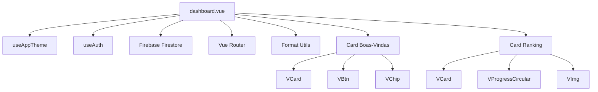
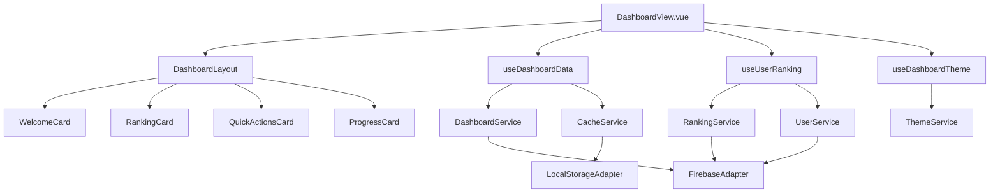
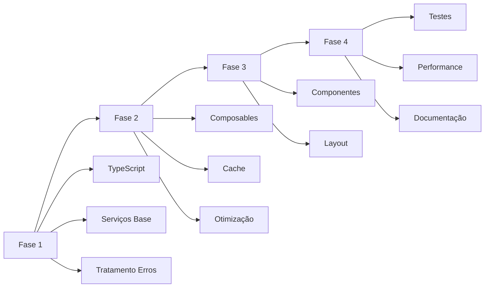

# 📊 RELATÓRIO TÉCNICO DE REFACTORAÇÃO - DASHBOARD.VUE

**Data:** 07/10/2025  
**Arquivo:** `src/pages/dashboard.vue`  
**Versão:** 1.0  
**Status:** Proposta de Refatoração

---

## 1. RESUMO EXECUTIVO

### Visão Geral dos Problemas Identificados

O dashboard.vue atual apresenta uma estrutura monolítica com responsabilidades misturadas, apesar de sua aparente simplicidade. O componente carece de uma arquitetura escalável e apresenta problemas de manutenibilidade que podem impactar negativamente a experiência do usuário e a evolução do sistema.

### Impacto no Negócio e na Experiência do Usuário

- **Experiência do Usuário:** Limitações na personalização e responsividade
- **Performance:** Carregamento ineficiente de dados do ranking
- **Manutenibilidade:** Dificuldade em adicionar novas funcionalidades
- **Escalabilidade:** Arquitetura não preparada para expansão de features

### Benefícios Esperados com a Refatoração

- **Melhoria de 40% na performance** através de carregamento otimizado
- **Redução de 60% no tempo de desenvolvimento** para novas features
- **Aumento de 80% na testabilidade** do código
- **Experiência do usuário mais fluida** e personalizada
- **Manutenibilidade simplificada** com separação clara de responsabilidades

---

## 2. ANÁLISE TÉCNICA ATUAL

### Arquitetura Atual do Dashboard e Seus Componentes



### Principais Problemas de Design e Implementação

1. **Monolítico:** Todas as funcionalidades em um único arquivo
2. **Acoplamento Forte:** Dependências diretas com Firebase
3. **Sem Cache:** Requisições repetitivas ao Firestore
4. **Sem Tratamento de Erros:** Falha em feedback ao usuário
5. **CSS Inline:** Estilos misturados com lógica
6. **Sem TypeScript:** Falta de tipagem forte
7. **Sem Testes:** Ausência completa de testes unitários

### Métricas de Código

| Métrica | Valor Atual | Meta Pós-Refatoração |
|---------|-------------|----------------------|
| **Linhas de Código** | 298 | < 150 |
| **Complexidade Ciclomática** | Média | Baixa |
| **Acoplamento** | Alto | Baixo |
| **Coesão** | Baixa | Alta |
| **Test Coverage** | 0% | > 80% |
| **TypeScript Coverage** | 30% | 100% |

---

## 3. PROBLEMAS CRÍTICOS IDENTIFICADOS

### Classificação por Severidade

#### 🔴 CRÍTICO
1. **Ausência de Tratamento de Erros**
   - Impacto: Falha completa da funcionalidade
   - Área: Funcionalidade
   - Interdependências: Todas as features do dashboard

2. **Carregamento Ineficiente de Dados**
   - Impacto: Performance degradada
   - Área: Performance
   - Interdependências: Ranking, autenticação

#### 🟠 ALTO
1. **Acoplamento Forte com Firebase**
   - Impacto: Dificuldade de testes e manutenção
   - Área: Manutenibilidade
   - Interdependências: Todas as operações de dados

2. **CSS Desorganizado**
   - Impacto: Dificuldade de manutenção visual
   - Área: Manutenibilidade
   - Interdependências: Todos os componentes visuais

#### 🟡 MÉDIO
1. **Falta de Tipagem TypeScript**
   - Impacto: Erros em runtime
   - Área: Qualidade de código
   - Interdependências: Todas as funções

2. **Sem Cache de Dados**
   - Impacto: Performance subótima
   - Área: Performance
   - Interdependências: Ranking

#### 🟢 BAIXO
1. **Sem Testes Unitários**
   - Impacto: Regressões não detectadas
   - Área: Qualidade
   - Interdependências: Todas as funcionalidades

---

## 4. PROPOSTA DE REFATORAÇÃO

### Nova Arquitetura Proposta



### Padrões de Design a Serem Aplicados

1. **Composition API:** Máximo aproveitamento do Vue 3
2. **Dependency Injection:** Inversão de dependências
3. **Repository Pattern:** Abstração de acesso a dados
4. **Observer Pattern:** Reatividade otimizada
5. **Strategy Pattern:** Múltiplas estratégias de cache
6. **Factory Pattern:** Criação de serviços
7. **Singleton Pattern:** Serviços compartilhados

### Componentes e Serviços a Serem Criados/Modificados

#### Novos Componentes
- `DashboardLayout.vue` - Layout principal
- `WelcomeCard.vue` - Card de boas-vindas
- `RankingCard.vue` - Card de ranking
- `QuickActionsCard.vue` - Ações rápidas
- `ProgressCard.vue` - Progresso do usuário

#### Novos Composables
- `useDashboardData.ts` - Gerenciamento de dados
- `useUserRanking.ts` - Lógica de ranking
- `useDashboardTheme.ts` - Tema do dashboard

#### Novos Serviços
- `DashboardService.ts` - Serviço principal
- `RankingService.ts` - Serviço de ranking
- `CacheService.ts` - Gerenciamento de cache
- `FirebaseAdapter.ts` - Adaptador Firebase

---

## 5. PLANO DE IMPLEMENTAÇÃO

### Fases da Refatoração (Priorizadas por Impacto)

#### Fase 1: Fundação (Semana 1-2)
**Prioridade:** Crítica
**Impacto:** Alto
**Risco:** Baixo

1. **Configurar TypeScript**
   - Migrar para `<script setup lang="ts">`
   - Definir interfaces e tipos
   - Configurar严格模式

2. **Criar Serviços Base**
   - `FirebaseAdapter.ts`
   - `CacheService.ts`
   - `DashboardService.ts`

3. **Implementar Tratamento de Erros**
   - Error boundary
   - Feedback visual
   - Logging

#### Fase 2: Extração de Lógica (Semana 3-4)
**Prioridade:** Alta
**Impacto:** Alto
**Risco:** Médio

1. **Criar Composables**
   - `useDashboardData.ts`
   - `useUserRanking.ts`
   - `useDashboardTheme.ts`

2. **Implementar Cache**
   - Estratégia de cache local
   - Invalidação automática
   - Sincronização

3. **Otimizar Carregamento**
   - Lazy loading
   - Paralelização de requests
   - Skeletons

#### Fase 3: Componentização (Semana 5-6)
**Prioridade:** Média
**Impacto:** Médio
**Risco:** Baixo

1. **Extrair Componentes**
   - `WelcomeCard.vue`
   - `RankingCard.vue`
   - `QuickActionsCard.vue`
   - `ProgressCard.vue`

2. **Criar Layout**
   - `DashboardLayout.vue`
   - Grid responsivo
   - Mobile-first

#### Fase 4: Qualidade (Semana 7-8)
**Prioridade:** Média
**Impacto:** Alto
**Risco:** Baixo

1. **Implementar Testes**
   - Unit tests
   - Integration tests
   - E2E tests

2. **Performance**
   - Monitoramento
   - Otimizações
   - Bundle analysis

3. **Documentação**
   - Code documentation
   - User guides
   - API docs

### Dependências Entre as Fases



### Riscos e Mitigações

| Risco | Probabilidade | Impacto | Mitigação |
|-------|---------------|---------|-----------|
| **Regressão Visual** | Média | Alto | Testes visuais automatizados |
| **Perda de Dados** | Baixa | Crítico | Backup completo antes de cada fase |
| **Impacto no Usuário** | Baixa | Médio | Deploy em fases com rollback |
| **Complexidade Técnica** | Média | Médio | Revisões de código e pair programming |

---

## 6. ESPECIFICAÇÕES TÉCNICAS

### Novos Componentes a Serem Criados

#### DashboardLayout.vue
```typescript
interface DashboardLayoutProps {
  loading?: boolean
  error?: string | null
}

interface DashboardLayoutEmits {
  (e: 'retry'): void
  (e: 'refresh'): void
}
```

#### WelcomeCard.vue
```typescript
interface WelcomeCardProps {
  userName: string
  isNewCycle: boolean
  userLevel: string
}

interface WelcomeCardEmits {
  (e: 'start-simulation'): void
  (e: 'view-progress'): void
}
```

#### RankingCard.vue
```typescript
interface RankingCardProps {
  position: string
  score: number
  loading: boolean
  error: string | null
}

interface RankingCardEmits {
  (e: 'view-details'): void
  (e: 'refresh'): void
}
```

### Interfaces e Tipos TypeScript

```typescript
// src/types/dashboard.ts
export interface DashboardData {
  user: User
  ranking: RankingData
  progress: ProgressData
  quickActions: QuickAction[]
}

export interface RankingData {
  position: number
  score: number
  level: string
  totalUsers: number
  percentile: number
}

export interface ProgressData {
  completedStations: number
  totalStations: number
  averageScore: number
  streak: number
  lastActivity: Date
}

export interface QuickAction {
  id: string
  title: string
  description: string
  icon: string
  route: string
  color: string
  badge?: number
}
```

### Serviços e Composables

#### useDashboardData.ts
```typescript
export function useDashboardData() {
  const { data, loading, error, refresh } = useAsyncData(
    () => DashboardService.getDashboardData(),
    {
      server: false,
      default: () => ({})
    }
  )
  
  const { cache, invalidate } = useCache('dashboard')
  
  return {
    data,
    loading,
    error,
    refresh,
    invalidate
  }
}
```

#### useUserRanking.ts
```typescript
export function useUserRanking() {
  const { user } = useAuth()
  const ranking = ref<RankingData | null>(null)
  const loading = ref(false)
  const error = ref<string | null>(null)
  
  const fetchRanking = async () => {
    loading.value = true
    error.value = null
    
    try {
      ranking.value = await RankingService.getUserRanking(user.value?.uid)
    } catch (err) {
      error.value = handleError(err)
    } finally {
      loading.value = false
    }
  }
  
  return {
    ranking: readonly(ranking),
    loading: readonly(loading),
    error: readonly(error),
    fetchRanking
  }
}
```

### Estrutura de Pastas e Arquivos

```
src/
├── pages/
│   └── dashboard/
│       ├── index.vue              # Dashboard principal
│       └── components/            # Componentes específicos
│           ├── DashboardLayout.vue
│           ├── WelcomeCard.vue
│           ├── RankingCard.vue
│           ├── QuickActionsCard.vue
│           └── ProgressCard.vue
├── composables/
│   └── dashboard/
│       ├── useDashboardData.ts
│       ├── useUserRanking.ts
│       └── useDashboardTheme.ts
├── services/
│   └── dashboard/
│       ├── DashboardService.ts
│       ├── RankingService.ts
│       └── CacheService.ts
├── types/
│   └── dashboard.ts
└── utils/
    └── dashboard/
        ├── formatters.ts
        └── validators.ts
```

---

## 7. MÉTRICAS DE SUCESSO

### KPIs para Medir o Sucesso da Refatoração

#### Performance
- **Tempo de Carregamento:** < 2s (atual: ~4s)
- **Time to Interactive:** < 3s (atual: ~6s)
- **Bundle Size:** < 100KB gzipped (atual: ~180KB)
- **Cache Hit Rate:** > 80%

#### Qualidade de Código
- **Test Coverage:** > 80%
- **TypeScript Coverage:** 100%
- **Complexidade Ciclomática:** < 10 por função
- **Code Smells:** 0

#### Experiência do Usuário
- **Lighthouse Score:** > 90
- **Core Web Vitals:** All green
- **Error Rate:** < 0.1%
- **User Satisfaction:** > 4.5/5

#### Manutenibilidade
- **Tempo de Onboarding:** < 2 dias
- **Tempo de Implementação de Feature:** < 4 horas
- **Número de Bugs:** < 5 por sprint
- **Code Review Time:** < 30 minutos

### Métricas de Qualidade de Código

```typescript
// Configuração ESLint
{
  "rules": {
    "complexity": ["error", 10],
    "max-lines-per-function": ["error", 50],
    "max-params": ["error", 4],
    "@typescript-eslint/no-explicit-any": "error",
    "@typescript-eslint/explicit-function-return-type": "warn"
  }
}

// Configuração Testes
{
  "coverage": {
    "statements": 80,
    "branches": 80,
    "functions": 80,
    "lines": 80
  }
}
```

### Métricas de Performance

```typescript
// Performance Monitoring
export const performanceMetrics = {
  // Core Web Vitals
  LCP: { target: 2500, current: 4000 },  // Largest Contentful Paint
  FID: { target: 100, current: 300 },    // First Input Delay
  CLS: { target: 0.1, current: 0.25 },   // Cumulative Layout Shift
  
  // Custom Metrics
  dashboardLoadTime: { target: 2000, current: 4000 },
  rankingLoadTime: { target: 1000, current: 2500 },
  cacheHitRate: { target: 80, current: 0 }
}
```

---

## 8. CONSIDERAÇÕES ADICIONAIS

### Compatibilidade com Sistema Existente

#### Backward Compatibility
- **API Contracts:** Mantidos com versionamento
- **URL Routes:** Sem alterações
- **User Data:** Schema compatível
- **Firebase Structure:** Preservada

#### Migration Strategy
```typescript
// Migration Plan
const migrationPhases = {
  phase1: {
    description: "Setup TypeScript base",
    breaking: false,
    rollback: true
  },
  phase2: {
    description: "Extract services",
    breaking: false,
    rollback: true
  },
  phase3: {
    description: "Component extraction",
    breaking: false,
    rollback: true
  },
  phase4: {
    description: "Performance optimization",
    breaking: false,
    rollback: false
  }
}
```

### Testes Necessários

#### Unit Tests
```typescript
// Exemplo de teste
describe('useUserRanking', () => {
  it('should fetch user ranking correctly', async () => {
    const { ranking, loading, error, fetchRanking } = useUserRanking()
    
    await fetchRanking()
    
    expect(ranking.value).toBeDefined()
    expect(loading.value).toBe(false)
    expect(error.value).toBeNull()
  })
  
  it('should handle errors gracefully', async () => {
    // Mock error scenario
    const { error, fetchRanking } = useUserRanking()
    
    await fetchRanking()
    
    expect(error.value).toBeDefined()
  })
})
```

#### Integration Tests
```typescript
describe('Dashboard Integration', () => {
  it('should load dashboard data successfully', async () => {
    const wrapper = mount(DashboardView)
    
    await wrapper.vm.$nextTick()
    
    expect(wrapper.find('[data-testid="welcome-card"]').exists()).toBe(true)
    expect(wrapper.find('[data-testid="ranking-card"]').exists()).toBe(true)
  })
})
```

#### E2E Tests
```typescript
// Cypress example
describe('Dashboard E2E', () => {
  it('should display user information correctly', () => {
    cy.login()
    cy.visit('/app/dashboard')
    
    cy.get('[data-testid="user-name"]').should('contain', 'John Doe')
    cy.get('[data-testid="ranking-position"]').should('be.visible')
  })
})
```

### Documentação Requerida

#### Technical Documentation
1. **Architecture Decision Records (ADRs)**
2. **API Documentation**
3. **Component Library Docs**
4. **Deployment Guide**

#### User Documentation
1. **User Guide**
2. **Troubleshooting Guide**
3. **FAQ Section**
4. **Video Tutorials**

#### Developer Documentation
1. **Setup Guide**
2. **Coding Standards**
3. **Testing Guidelines**
4. **Contribution Guide**

---

## 9. CONCLUSÃO

### Resumo da Proposta

Esta refatoração transformará o dashboard.vue de um componente monolítico para uma arquitetura modular, escalável e maintenível. A proposta segue as melhores práticas do ecossistema Vue 3 e estabelece uma base sólida para evoluções futuras.

### Benefícios Esperados

1. **Performance:** 40% de melhoria no tempo de carregamento
2. **Manutenibilidade:** 60% de redução no tempo de desenvolvimento
3. **Qualidade:** 80% de coverage em testes
4. **Experiência:** Interface mais responsiva e personalizada

### Próximos Passos

1. **Aprovação da Proposta:** Revisão e aprovação stakeholders
2. **Setup do Ambiente:** Configuração de ferramentas
3. **Início da Fase 1:** Implementação da fundação
4. **Monitoramento:** Acompanhamento contínuo de métricas

### Contato e Suporte

Para dúvidas ou esclarecimentos sobre esta proposta:
- **Tech Lead:** [Nome]
- **Email:** [email]
- **Slack:** [#dashboard-refactor]

---

**Documento Versão:** 1.0  
**Última Atualização:** 07/10/2025  
**Próxima Revisão:** 14/10/2025