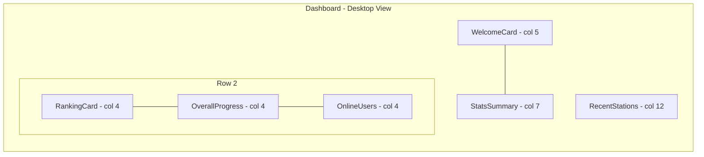

# Proposta de Nova Arquitetura para o Dashboard RevalidaFlow

## 1. Introdução

Este documento detalha a proposta de redesenho completo da arquitetura visual e de componentes para o dashboard do RevalidaFlow. O objetivo é criar uma experiência de usuário mais moderna, profissional e intuitiva, abordando o feedback sobre problemas visuais, design dos cards, bugs de CSS e a adição de novas funcionalidades.

## 2. Novo Layout do Grid

A proposta abandona o layout linear atual em favor de uma estrutura mais dinâmica e equilibrada, que prioriza a informação de forma hierárquica. O novo grid foi pensado para ser responsivo e adaptável a diferentes tamanhos de tela.

### Diagrama do Novo Grid (Mermaid)



### Estrutura do Grid com `VRow` e `VCol`

*   **Linha 1:**
    *   `WelcomeCard`: `md="5"` - Mais compacto e direto.
    *   `StatsSummaryCard`: `md="7"` - Ganha mais espaço para exibir os gráficos de forma clara.
*   **Linha 2:**
    *   `RankingCard`: `md="4"` - Compacto, focado na posição e com um link para a página de detalhes.
    *   `OverallProgressCard`: `md="4"` - Mantém um tamanho médio, ideal para barras de progresso.
    *   `OnlineUsersCard` **(Novo)**: `md="4"` - Novo card para exibir usuários online.
*   **Linha 3:**
    *   `RecentStationsCard`: `md="12"` - Ocupa toda a largura, comportando melhor a lista de estações.

## 3. Redesenho dos Cards (Conceito Visual e Arquitetura)

O design geral será unificado com base em princípios modernos: gradientes sutis, sombras suaves (`elevation`), tipografia clara e ícones consistentes (ex: `remixicon`).

---

### a. `WelcomeCard`

*   **Conceito**: Mais pessoal e menos genérico. O foco é uma saudação rápida e um ponto de partida claro.
*   **Design**:
    *   **Header**: Gradiente sutil (ex: `primary` para `primary-darken-1`).
    *   **Ícone**: Ícone de "mão acenando" ou similar, mais amigável.
    *   **Botão**: Estilo `variant="tonal"` ou `variant="outlined"` em vez de um botão sólido e grande, para ser menos intrusivo.
*   **Estrutura do Componente**:
    *   **Props**: `{ userName: string }` (sem alteração).
    *   **Events**: Nenhum.

---

### b. `RankingCard`

*   **Conceito**: Transformar de um card grande e com uma imagem de troféu chamativa para um "widget" de status, focado na informação principal: a posição no ranking.
*   **Design**:
    *   **Remoção**: A imagem do troféu (`trophy.png`) será removida para compactar o card.
    *   **Destaque**: A posição (ex: `#128`) será o elemento visual principal, com uma fonte grande e em negrito.
    *   **Ação**: O botão "Ver Detalhes" será substituído por um link sutil no rodapé do card ou um ícone de "ver mais".
*   **Estrutura do Componente**:
    *   **Props**: `{ rankingData: { posicao: number, aproveitamento: number }, loading: boolean }`. Simplificado para conter apenas os dados essenciais.
    *   **Events**: `(e: 'view-details')`.

---

### c. `StatsSummaryCard`

*   **Conceito**: Organizar as três estatísticas principais (Pontuação Média, Melhor Pontuação, Streak) de forma mais limpa e com melhor hierarquia visual.
*   **Design**:
    *   **Layout Interno**: Usar `VRow` e `VCol` internamente para garantir que os 3 sub-cards se alinhem corretamente em todas as telas.
    *   **Gráficos**: Manter os `radialBar` do ApexCharts, mas com um design mais limpo (menos sombras, cores alinhadas ao tema).
    *   **Interatividade**: Adicionar um efeito de `hover` sutil nos sub-cards.
*   **Estrutura do Componente**:
    *   **Props**: `{ stats: { averageScore: number, bestScore: number, streak: number }, loading: boolean }`.
    *   **Events**: Nenhum.

---

### d. `OverallProgressCard`

*   **Conceito**: Melhorar a legibilidade e o apelo visual das barras de progresso.
*   **Design**:
    *   **Progresso Total**: A barra de progresso principal terá mais destaque.
    *   **Progresso por Módulo**: A lista de módulos será mais espaçada e os ícones terão um tamanho consistente. O uso de cores (sucesso, aviso, erro) será mantido.
*   **Estrutura do Componente**:
    *   **Props**: `{ stats: { overallProgress: number, performanceByArea: Array<{ name: string, score: number }> }, loading: boolean }`.
    *   **Events**: Nenhum.

---

### e. `RecentStationsCard`

*   **Conceito**: Corrigir os problemas de layout e melhorar a experiência de interação com a lista.
*   **Design**:
    *   **Correção de CSS**: O `VListItemSubtitle` será estilizado com `display: flex` e `flex-wrap: wrap` para garantir que o `VChip` e a data não quebrem o layout em telas menores.
    *   **Hover**: Adicionar um efeito de `hover` mais pronunciado nos itens da lista para indicar que são clicáveis.
    *   **Botão "Iniciar"**: O botão será mais destacado, talvez com uma cor mais vibrante no hover.
*   **Estrutura do Componente**:
    *   **Props**: `{ stations: Array<{ id: string, titulo: string, especialidade: string, createdAt: Date }>, loading: boolean }`.
    *   **Events**: `(e: 'start-station', stationId: string)`.

---

### f. `OnlineUsersCard` (Novo)

*   **Conceito**: Um card simples para exibir o número de usuários online na plataforma, adicionando um senso de comunidade.
*   **Design**:
    *   **Visual**: Um ícone de "usuário" com um ponto verde para indicar "online". O número de usuários será o destaque.
    *   **Layout**: Simples, com título, ícone e o número de usuários.
*   **Estrutura do Componente**:
    *   **Props**: `{ userCount: number, loading: boolean }`.
    *   **Events**: Nenhum.

## 4. Estratégia de Estilização

1.  **Variáveis CSS**: Centralizar as cores, fontes, sombras e `border-radius` em um arquivo de variáveis CSS (`src/styles/settings/_variables.scss` ou similar) para garantir consistência.
2.  **Classes Utilitárias**: Continuar usando as classes do Vuetify, mas criar classes utilitárias específicas para o dashboard (ex: `.dashboard-card`) para padronizar `padding`, `border-radius`, etc.
3.  **BEM (Block, Element, Modifier)**: Adotar uma convenção BEM leve para os componentes internos dos cards para evitar conflitos de CSS. Exemplo: `RankingCard` (bloco), `ranking-card__title` (elemento).
4.  **Correção do Bug em `RecentStationsCard`**:
    *   Aplicar `display: flex`, `align-items: center`, e `flex-wrap: wrap` no contêiner do `VListItemSubtitle`.
    *   Garantir que o `VChip` e o texto da data tenham margens adequadas para não colidirem.

## 5. Animações e Micro-interações

1.  **Animação de Entrada**: Manter a animação `fade-slide` atual, mas aplicar um efeito "stagger" (atraso sequencial) para que os cards apareçam um após o outro, criando uma entrada mais fluida. Isso pode ser feito com a `TransitionGroup` do Vue ou uma biblioteca como a `gsap`.
2.  **Micro-interações**:
    *   **Hover nos Cards**: Um leve aumento da sombra (`elevation`) e um sutil `transform: translateY(-4px)`.
    *   **Hover em Botões/Links**: Efeito de transição na cor ou no fundo.
    *   **Gráficos**: Adicionar animações nos gráficos ApexCharts para quando os dados são carregados.

## 6. Pseudo-Exemplo de Código

### `RankingCard.vue` (Redesenhado)

```vue
<template>
  <VCard class="dashboard-card ranking-card">
    <VCardItem>
      <VCardTitle class="ranking-card__title">Sua Posição</VCardTitle>
    </VCardItem>
    <VCardText class="ranking-card__body">
      <div v-if="loading" class="text-center">
        <VProgressCircular indeterminate />
      </div>
      <div v-else class="ranking-card__content">
        <span class="ranking-card__position">#{{ rankingData.posicao }}</span>
        <span class="ranking-card__meta">{{ rankingData.aproveitamento }}% de aproveitamento</span>
      </div>
    </VCardText>
    <VCardActions class="ranking-card__actions">
      <VBtn variant="text" color="primary" @click="$emit('view-details')">
        Ver Ranking Completo
      </VBtn>
    </VCardActions>
  </VCard>
</template>

<style scoped>
.ranking-card__title {
  font-size: 1rem;
  color: rgba(var(--v-theme-on-surface), var(--v-medium-emphasis-opacity));
}
.ranking-card__body {
  display: flex;
  align-items: center;
  justify-content: center;
  min-height: 100px;
}
.ranking-card__content {
  display: flex;
  flex-direction: column;
  align-items: center;
}
.ranking-card__position {
  font-size: 3rem;
  font-weight: 700;
  color: rgb(var(--v-theme-primary));
}
.ranking-card__meta {
  font-size: 0.875rem;
}
.ranking-card__actions {
  justify-content: center;
}
</style>
```
