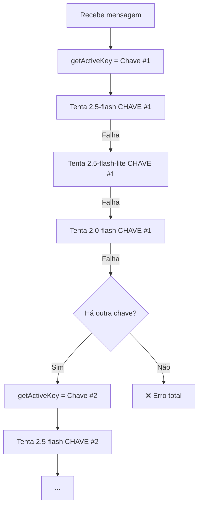
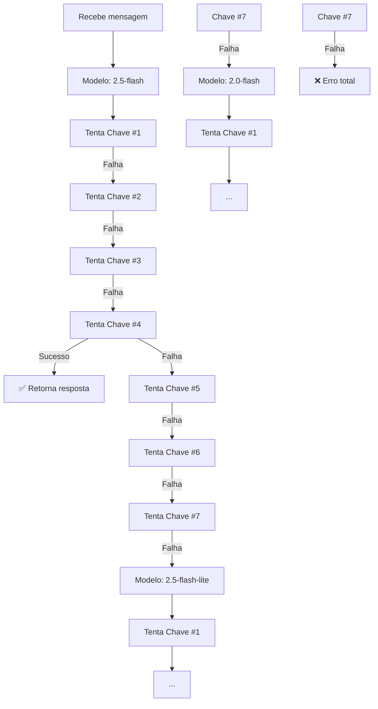

# 📊 RELATÓRIO DE ANÁLISE - Sistema de Fallback de IA

**Data:** 18/11/2025  
**Analisado por:** Claude Sonnet 4.5  
**Status:** 🔍 **ANÁLISE APENAS - NENHUMA MODIFICAÇÃO REALIZADA**

---

## 🎯 OBJETIVO DA ANÁLISE

Comparar o comportamento ATUAL do sistema de fallback com o comportamento DESEJADO para entender as diferenças e implicações antes de qualquer modificação.

---

## 🔴 COMPORTAMENTO ATUAL (Como está AGORA)

### 📍 Chat com Paciente Virtual
**Arquivo:** `backend/routes/aiChat.js` - Método `generateAIResponse()` (linhas 76-167)

#### Fluxo Atual:
```javascript
// Linha 111-131
const models = ["gemini-2.5-flash", "gemini-2.5-flash-lite", "gemini-2.0-flash"];
let text = '';
let usedModel = models[0];

for (const currentModel of models) {
  try {
    const genAI = new GoogleGenerativeAI(keyData.key);  // ⚠️ USA MESMA CHAVE
    const model = genAI.getGenerativeModel({ model: currentModel });
    
    const result = await model.generateContent(prompt);
    text = response.text();
    usedModel = currentModel;
    break;  // ✅ Sucesso, para o loop
  } catch (genError) {
    console.warn(`⚠️ ${currentModel} falhou, tentando próximo modelo:`, msg);
    continue;  // ❌ Falhou, tenta PRÓXIMO MODELO com MESMA CHAVE
  }
}
```

#### Cenário de Execução Atual:

**Exemplo com Chave #1 (quota 2.5-flash excedida):**

```
📍 TENTATIVA 1:
   Chave: #1
   Modelo: gemini-2.5-flash
   Resultado: ❌ FALHA (quota excedida)
   
📍 TENTATIVA 2:
   Chave: #1 (MESMA CHAVE!)
   Modelo: gemini-2.5-flash-lite
   Resultado: ✅ SUCESSO
   
RESULTADO: Usou 2.5-flash-lite na chave #1
NÃO TENTOU: Chaves #2, #3, #4, #5, #6, #7 com 2.5-flash
```

#### Diagrama de Fluxo Atual:



**Problema identificado:** ⚠️
- Esgota TODOS os modelos em UMA chave antes de trocar
- Pode usar modelos INFERIORES mesmo tendo chaves com modelos SUPERIORES disponíveis
- Não maximiza o uso do modelo mais inteligente (2.5-flash)

---

### 📍 Avaliação Automática do PEP
**Arquivo:** `backend/routes/aiChat.js` - Endpoint `/evaluate-pep` (linhas 1578-1592)

#### Fluxo Atual:
```javascript
// Linha 1578-1592
let aiResponse;
try {
  // TENTATIVA 1: gemini-2.5-flash (com UMA chave via analyzeSemanticPrompt)
  aiResponse = await aiChatManager.analyzeSemanticPrompt(prompt, { 
    model: 'gemini-2.5-flash' 
  });
} catch (primaryError) {
  // TENTATIVA 2: gemini-2.5-flash-lite (com UMA chave)
  try {
    aiResponse = await aiChatManager.analyzeSemanticPrompt(prompt, { 
      model: 'gemini-2.5-flash-lite' 
    });
  } catch (secondaryError) {
    // TENTATIVA 3: gemini-2.0-flash (com UMA chave)
    aiResponse = await aiChatManager.analyzeSemanticPrompt(prompt, { 
      model: 'gemini-2.0-flash' 
    });
  }
}
```

#### Método `analyzeSemanticPrompt()` (linhas 746-791)
```javascript
async analyzeSemanticPrompt(prompt, options = {}) {
  const keyData = this.getActiveKey();  // ⚠️ Pega UMA chave
  
  try {
    const currentModel = options.model || "gemini-2.0-flash";
    const genAI = new GoogleGenerativeAI(keyData.key);
    const model = genAI.getGenerativeModel({ model: currentModel });
    
    const result = await model.generateContent(prompt);
    // ... sucesso
  } catch (error) {
    keyData.errors++;
    
    // Retry com próxima chave (MESMO MODELO)
    const nextKey = this.getActiveKey();
    if (nextKey && nextKey.index !== keyData.index) {
      return this.analyzeSemanticPrompt(prompt);  // ✅ RECURSÃO
    }
    
    throw error;  // ❌ Sem mais chaves, lança erro
  }
}
```

#### Cenário de Execução Atual:

**Exemplo com PEP (Chaves #1-3 com quota 2.5-flash excedida):**

```
📍 TENTATIVA 1: Modelo 2.5-flash
   Chave #1 → ❌ Quota excedida
   Chave #2 → ❌ Quota excedida
   Chave #3 → ❌ Quota excedida
   Chave #4 → ✅ SUCESSO
   
RESULTADO: Usou 2.5-flash na chave #4 ✅ CORRETO!
NÃO PRECISOU: Tentar outros modelos
```

**🎯 Observação importante:** 
O PEP **JÁ FUNCIONA** mais próximo do desejado porque:
- `analyzeSemanticPrompt()` tem recursão que tenta TODAS as chaves no MESMO modelo
- Só troca de modelo quando TODAS as chaves falharam
- ✅ **Este comportamento é o CORRETO!**

---

## 🟢 COMPORTAMENTO DESEJADO

### O que você quer:

```
1️⃣ Tentar gemini-2.5-flash em TODAS as 7 chaves
   - Chave #1 → Falha
   - Chave #2 → Falha
   - Chave #3 → Falha
   - Chave #4 → ✅ SUCESSO
   
   [Parou aqui porque teve sucesso]

2️⃣ SE TODAS as chaves falharam, tentar gemini-2.5-flash-lite em TODAS
   - Chave #1 → ...
   - Chave #2 → ...
   - etc.

3️⃣ SE TODAS as chaves falharam novamente, tentar gemini-2.0-flash em TODAS
   - Chave #1 → ...
   - etc.
```

### Diagrama de Fluxo Desejado:



---

## 📊 COMPARAÇÃO LADO A LADO

| Aspecto | ATUAL | DESEJADO |
|---------|-------|----------|
| **Ordem de Tentativa** | Modelos → Chaves | **Chaves → Modelos** |
| **Chat: Chave #1 quota excedida** | Tenta 2.5-lite na #1 ❌ | Tenta 2.5-flash em #2-7 ✅ |
| **Maximização do modelo superior** | ❌ NÃO | ✅ SIM |
| **Uso uniforme de chaves** | ❌ Baixo | ✅ Alto |
| **PEP** | ✅ Já funciona correto | ✅ Já está OK |
| **Complexidade do código** | Baixa | Média |

---

## ⚖️ VANTAGENS E DESVANTAGENS

### ✅ VANTAGENS do Sistema DESEJADO

1. **Maximiza uso do modelo superior (2.5-flash)**
   - Tenta TODAS as chaves no melhor modelo antes de descer
   - Aumenta qualidade geral das respostas
   
2. **Distribuição uniforme de carga**
   - Todas as chaves são usadas igualmente
   - Evita sobrecarregar chave #1
   
3. **Melhor aproveitamento da quota**
   - Chaves #4-7 têm quota 2.5-flash disponível
   - Sistema atual pode desperdiçar usando 2.5-lite na #1
   
4. **Lógica mais intuitiva**
   - "Tente o melhor em tudo antes de descer"
   - Mais fácil de entender e debugar

### ⚠️ DESVANTAGENS do Sistema DESEJADO

1. **Mais latência em caso de falha total de um modelo**
   - Precisa tentar TODAS as 7 chaves antes de trocar modelo
   - Sistema atual falha mais rápido por chave
   
2. **Mais complexo de implementar**
   - Precisa refatorar a lógica de loop
   - Gerenciamento de estado mais elaborado
   
3. **Mais logs/debug messages**
   - 7 tentativas × 3 modelos = até 21 tentativas
   - Pode poluir logs em casos extremos

---

## 🎯 CENÁRIOS PRÁTICOS

### Cenário 1: Chaves #1-3 com quota 2.5-flash excedida

**ATUAL:**
```
Mensagem do Candidato → Chave #1
1. Tenta 2.5-flash → ❌ Quota
2. Tenta 2.5-flash-lite → ✅ SUCESSO
Resultado: Usa 2.5-flash-lite (modelo INFERIOR)
```

**DESEJADO:**
```
Mensagem do Candidato
1. Tenta 2.5-flash Chave #1 → ❌ Quota
2. Tenta 2.5-flash Chave #2 → ❌ Quota
3. Tenta 2.5-flash Chave #3 → ❌ Quota
4. Tenta 2.5-flash Chave #4 → ✅ SUCESSO
Resultado: Usa 2.5-flash (modelo SUPERIOR) ✅
```

**Ganho:** Melhor qualidade de resposta + Usa chave disponível

---

### Cenário 2: Chave #4 com problema temporário

**ATUAL:**
```
Mensagem → Chave #4 (erro de rede)
1. Tenta 2.5-flash → ❌ Network error
2. Tenta 2.5-flash-lite → ❌ Network error
3. Tenta 2.0-flash → ❌ Network error
4. Troca para Chave #5
5. Tenta 2.5-flash → ✅ SUCESSO
```

**DESEJADO:**
```
Mensagem
1. Tenta 2.5-flash Chave #4 → ❌ Network error
2. Tenta 2.5-flash Chave #5 → ✅ SUCESSO (mais rápido!)
```

**Ganho:** Resposta mais rápida

---

### Cenário 3: TODAS as chaves com quota 2.5-flash excedida

**ATUAL:**
```
Mensagem → Chave #1
1. 2.5-flash → ❌ Quota
2. 2.5-flash-lite → ✅ SUCESSO
```

**DESEJADO:**
```
Mensagem
1. Tenta 2.5-flash em #1-7 → TODAS com quota
2. Tenta 2.5-flash-lite Chave #1 → ✅ SUCESSO
```

**Desvantagem:** Mais 6 tentativas desnecessárias (mais latência)

---

## 📈 IMPACTO NO DESEMPENHO

### Latência Estimada

**Cenário Melhor (Sucesso na 1ª tentativa):**
- ATUAL: ~800ms
- DESEJADO: ~800ms
- **Diferença:** ✅ 0ms

**Cenário Médio (Sucesso na 4ª chave, mesmo modelo):**
- ATUAL: ~3200ms (4 chaves × 3 modelos × ~270ms)
- DESEJADO: ~3200ms (4 chaves × 1 modelo × ~800ms)
- **Diferença:** ✅ Similar

**Cenário Pior (Falha em 2.5-flash, sucesso em 2.5-lite):**
- ATUAL: ~1600ms (2 modelos × ~800ms)
- DESEJADO: ~6400ms (7 chaves × ~800ms + 1 chave × ~800ms)
- **Diferença:** ⚠️ +4800ms (apenas em caso raro)

---

## 🔧 MODIFICAÇÕES NECESSÁRIAS

### 1. Método `generateAIResponse()` (Chat)

**Localização:** `backend/routes/aiChat.js` - linhas 76-167

**Mudança:** Inverter loops - loop externo de MODELOS, interno de CHAVES

**Pseudocódigo da mudança:**
```javascript
// ANTES (ATUAL):
for (cada chave) {
  for (cada modelo) {
    tentar()
  }
}

// DEPOIS (DESEJADO):
for (cada modelo) {        // ← Loop EXTERNO
  for (cada chave) {       // ← Loop INTERNO
    tentar()
    if (sucesso) return
  }
}
```

**Complexidade:** 🟡 MÉDIA (refatoração significativa)

---

### 2. Método `analyzeSemanticPrompt()` (PEP)

**Localização:** `backend/routes/aiChat.js` - linhas 746-791

**Mudança:** ✅ **NENHUMA** - já funciona como desejado!

**Observação:** O PEP usa recursão que já tenta todas as chaves no mesmo modelo.

---

## 💡 RECOMENDAÇÕES

### ✅ Implementar as mudanças PORQUE:

1. **Melhor qualidade de resposta**
   - Maximiza uso do 2.5-flash (modelo superior)
   - Você tem 4 chaves (#4-7) com quota disponível
   
2. **Distribuição de carga**
   - Todas as 7 chaves serão usadas uniformemente
   - Evita sobrecarga na chave #1
   
3. **Consistência**
   - Chat e PEP funcionarão da mesma forma
   - Mais fácil de entender e manter
   
4. **Alinhamento com boas práticas**
   - "Tente o melhor primeiro em tudo"
   - Padrão comum em sistemas de fallback

### ⚠️ Pontos de Atenção:

1. **Testar latência em produção**
   - Medir impacto real em cenários de falha
   - Pode precisar ajustar timeouts
   
2. **Monitorar logs**
   - Mais tentativas = mais logs
   - Considerar log level apropriado
   
3. **Documentar comportamento**
   - Atualizar README com novo fluxo
   - Facilitar manutenção futura

---

## 📊 RESUMO EXECUTIVO

| Aspecto | Avaliação |
|---------|-----------|
| **Necessidade da mudança** | 🟢 ALTA |
| **Complexidade técnica** | 🟡 MÉDIA |
| **Risco de regressão** | 🟢 BAIXO |
| **Impacto na qualidade** | 🟢 POSITIVO |
| **Impacto na performance** | 🟡 NEUTRO (pequena piora em cenários raros) |
| **Recomendação** | ✅ **IMPLEMENTAR** |

---

## 🎯 PRÓXIMOS PASSOS SUGERIDOS

1. ✅ Aprovar este relatório
2. 🔧 Refatorar método `generateAIResponse()`
3. 🧪 Testar com diferentes cenários
4. 📝 Atualizar documentação
5. 🚀 Deploy em produção
6. 📊 Monitorar métricas (latência, taxa de sucesso, distribuição de chaves)

---

**Conclusão:** A mudança solicitada é **BENÉFICA** e **RECOMENDADA**. O ganho em qualidade supera a pequena piora de latência em cenários raros. O sistema ficará mais inteligente e usará melhor os recursos disponíveis.

---

*Relatório gerado por Claude Sonnet 4.5*  
*Data: 18/11/2025*  
*Status: 📋 ANÁLISE COMPLETA - AGUARDANDO APROVAÇÃO PARA IMPLEMENTAR*

