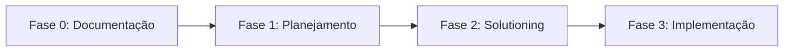

# Guia Completo do BMAD para Revalidaflow

## 📘 O Que é BMAD?

**BMAD** (Building Multi-Agent Development) é uma metodologia de desenvolvimento assistido por IA que divide o trabalho em **Fases**, **Agentes** e **Workflows**.

Pense nisso como ter uma **equipe virtual de especialistas** (Product Manager, Arquiteto, Desenvolvedor, etc.) que trabalham em etapas bem definidas.

---

## 🏗️ Estrutura do BMAD

### As 4 Fases do Desenvolvimento



#### Fase 0: Documentação (✅ Concluído)
**Objetivo**: Criar a "memória" do projeto para a IA.

**O que fizemos**:
- ✅ Gerado `docs/index.md` (Master Entry Point)
- ✅ Criado `docs/project-overview.md`
- ✅ Documentado arquitetura e estrutura

**Quando usar novamente**: Se reformular muito o projeto.

---

#### Fase 1: Planejamento
**Objetivo**: Definir **O QUE** será feito (requisitos, escopo).

**Quando usar**:
- Nova funcionalidade grande (ex: "Sistema de Conquistas")
- Mudança de arquitetura
- Integração externa

**Workflows Principais**:
- `product-brief` - Brainstorming inicial
- `prd` - Product Requirements Document (FRs/NFRs)
- `research` - Pesquisa de mercado/técnica

**Exemplo de Uso**:
```
Você: "Quero criar um sistema de notificações push"
IA: "Vamos usar o workflow 'prd' para detalhar isso"
```

---

#### Fase 2: Solutioning (Arquitetura)
**Objetivo**: Definir **COMO** será feito (design técnico).

**Quando usar**: Após aprovar o PRD da Fase 1.

**Workflows Principais**:
- `architecture` - Estende/atualiza a arquitetura
- `create-epics-and-stories` - Divide em tarefas
- `implementation-readiness` - Valida se está pronto

**Saída**: Epics (grandes blocos) e Stories (tarefas pequenas).

---

#### Fase 3: Implementação
**Objetivo**: **FAZER** o que foi planejado (código).

**Workflows Principais**:
- `sprint-planning` - Inicializa rastreamento
- `story-context` - Prepara contexto antes de codar
- `dev-story` - Desenvolve uma story
- `code-review` - Revisa o código
- `retrospective` - Analisa depois do epic

---

## 👥 Os Agentes do BMAD

Cada **agente** tem uma "persona" e ferramentas específicas. Você **não precisa trocar manualmente**; basta mencionar o que quer fazer, e o agente certo será ativado.

### 🎯 Analista (Analyst)
**Especialidade**: Pesquisa e análise.

**Usa**:
- `document-project` (acabamos de fazer!)
- `research`
- `brainstorm-project`

**Exemplo**: "Analise as melhores práticas de WebSockets em Node.js"

---

### 📋 Gerente de Produto (PM)
**Especialidade**: Requisitos e planejamento.

**Usa**:
- `product-brief`
- `prd`
- `tech-spec` (Quick Flow - funcionalidades pequenas)

**Exemplo**: "Crie um PRD para um sistema de relatóriosavaliação"

---

### 🏛️ Arquiteto (Architect)
**Especialidade**: Design de sistemas.

**Usa**:
- `architecture`
- `create-epics-and-stories`
- `create-ux-design`

**Exemplo**: "Como devemos integrar OAuth2 no backend?"

---

### 👨‍💻 Desenvolvedor (Dev)
**Especialidade**: Código.

**Usa**:
- `dev-story`
- `code-review`

**Exemplo**: "Implemente a story X do epic Y"

---

### 📊 Scrum Master (SM)
**Especialidade**: Gerenciamento de sprint.

**Usa**:
- `sprint-planning`
- `story-context`
- `epic-tech-context`
- `correct-course`

**Exemplo**: "Onde estamos no sprint atual?"

---

### ✍️ Writer Técnico (Paige)
**Especialidade**: Documentação.

**Usa**:
- `document-project`

**Exemplo**: "Documente a API do backend"

---

## 🔄 Workflows Explicados

### Workflows de Uso Frequente

#### `tech-spec` (Quick Flow)
**Para**: Funcionalidades pequenas (1-5 dias).

**Input**: "Adicionar botão de exportar PDF"  
**Output**: Especificação técnica + 1-2 stories prontas  
**Pula**: Fase 2 (vai direto para implementação)

**Quando usar**: Bugfixes, pequenas melhorias, integrações simples.

---

#### `prd` (BMad Method)
**Para**: Funcionalidades grandes (1-4 semanas).

**Input**: "Sistema de gamificação completo"  
**Output**: PRD (requisitos funcionais/não-funcionais)  
**Próximo passo**: `architecture` workflow

**Quando usar**: Features novas, módulos inteiros.

---

#### `document-project`
**Para**: Gerar/atualizar documentação.

**Input**: Caminho do projeto  
**Output**: `docs/index.md`, `architecture.md`, etc.  
**Níveis**:
- **Quick** (2-5min): Análise de padrões, sem ler código
- **Deep** (10-30min): Lê arquivos críticos ← **Recomendado**
- **Exhaustive** (30-120min): Lê todos os arquivos

---

#### `dev-story`
**Para**: Implementar uma story.

**Input**: Arquivo `story-{epic}-{title}.md`  
**Output**: Código alterado, testes, validação  
**Pre-requisito**: Rodar `story-context` antes

---

## 🎮 Como Usar o BMAD no Dia a Dia

### Cenário 1: Pequena Melhoria
```
Você: "Quero adicionar um campo 'especialidade' no perfil do usuário"

IA: "Vou usar o Quick Flow (tech-spec) para isso"
→ Gera tech-spec.md
→ Cria 1-2 stories
→ Você aprova
→ dev-story implementa
```

**Fases Usadas**: 1 (planejamento leve) + 3 (implementação)

---

### Cenário 2: Feature Grande
```
Você: "Quero um sistema de mentoria entre alunos"

IA: "Vou usar o BMad Method (prd + architecture)"
→ Fase 1: Gera PRD com FRs/NFRs
→ Você revisa e aprova
→ Fase 2: Cria arquitetura e epics
→ Você aprova
→ Fase 3: Sprint planning + dev-story para cada tarefa
```

**Fases Usadas**: 1, 2 e 3 completas.

---

### Cenário 3: Análise de Código (O que você pediu agora)
```
Você: "Analise o código atual por bugs e lixo"

IA: Usa ferramentas de análise (grep, codebase_search)
→ Gera relatório (code-quality-report.md)
→ Sugere plano de ação
```

**Não precisa de workflow formal**, apenas análise direta.

---

## 🔁 Como Pausar e Continuar

### Sistema de Estado Automático

1. **Workflows com Estado**: Workflows como `document-project` salvam um `.json` com o progresso.
   - **Pausar**: Feche a sessão ou pare de interagir.
   - **Continuar**: Rode o workflow novamente → "Encontrei progresso salvo. Retomar?"

2. **Task.md**: Eu mantenho um checklist em `task.md`.
   - Marca `[x]` para concluído, `[/]` para em progresso, `[ ]` para pendente.
   - Na próxima sessão, eu leio esse arquivo e continuo do ponto certo.

3. **Artifacts**: Planos e walkthroughs ficam salvos em `.gemini/antigravity/brain/{session}/`.

### Exemplo Prático

```
[Sessão 1]
Você: "Vamos criar um sistema de chat"
IA: Gera PRD → Salva task.md com [/] Criar arquitetura

[Você fecha]

[Sessão 2]
Você: "Continue o sistema de chat"
IA: Lê task.md → "Vi que PRD está pronto. Vou criar a arquitetura agora"
```

---

## 📁 Arquivos Importantes do BMAD

### No Seu Projeto

- `docs/index.md` - Master Entry Point (IA sempre lê)
- `docs/architecture.md` - Arquitetura atual
- `artifacts/bmm-workflow-status.yaml` - Estado do workflow (se usando BMM)
- `.gemini/antigravity/brain/{session}/task.md` - Checklist da tarefa atual

### Workflows Instalados

Você tem 59 workflows instalados em `.agent/workflows/bmad/`:
- **BMM (BMad Method)**: 24 workflows (prd, architecture, dev-story, etc.)
- **CIS (Creative Innovation)**: 6 workflows (brainstorming, storytelling, etc.)
- **BMB (BMad Builder)**: 10 workflows (para criar novos agentes/workflows)
- **Core**: 2 workflows (brainstorming, party-mode)

### Para Ver Todos os Workflows

```bash
ls ".agent/workflows/bmad/"
```

---

## 🚀 Próximos Passos Recomendados

Agora que você tem a base (`docs/` estruturado), você pode:

1. **Resolver problemas de código** (veja `code-quality-report.md`)
2. **Planejar nova feature** com: "Vamos usar BMAD para criar [X]"
3. **Atualizar arquitetura**: "Execute `architecture` workflow"

**Dica de Ouro**: Sempre que pedir algo grande, diga: *"Vamos usar o método BMAD para isso"* e eu escolho o workflow certo automaticamente!

---

## ❓ Perguntas Frequentes

### "Preciso trocar de agente manualmente?"
**Não**. Apenas descreva o que quer. Eu ativo o agente certo.

### "Como sei qual workflow usar?"
**Não precisa saber**. Diga o que quer fazer, eu sugiro o ideal.

### "Posso pular fases?"
**Sim**. Para coisas pequenas, use `tech-spec` (pula Fase 2).

### "O que é 'Party Mode'?"
Um workflow que simula uma reunião com todos os agentes ao mesmo tempo. Use para decisões complexas!

---

## 📞 Resumo para Começar

1. ✅ **Documentação pronta** (`docs/index.md` existe)
2. 🎯 **Para nova feature**: "Vamos usar BMAD para criar [X]"
3. 🐛 **Para refatorar**: "Analise [Y] e sugira melhorias"
4. 📊 **Para ver progresso**: "Mostre o task.md"

**Sempre que começar algo novo, eu crio um `task.md` e vou marcando `[x]` conforme avanço. Você pode pausar a qualquer momento e eu continuo depois!**
